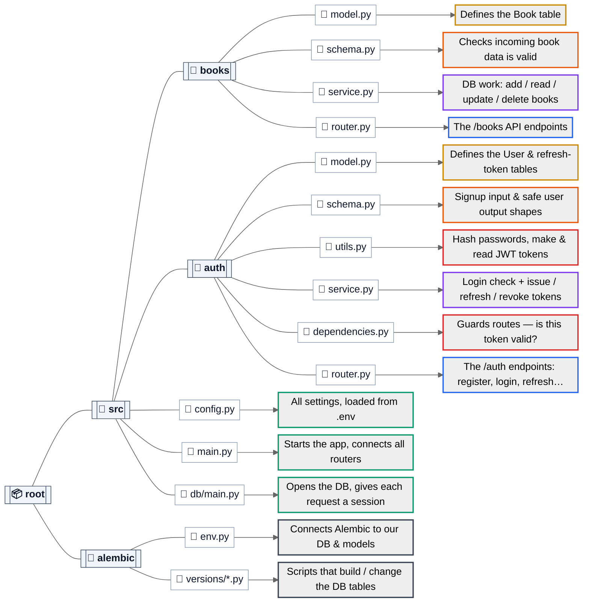

# FastAPI Backend Boilerplate — Living Guide

> An **evolving**, hands-on guide to this repo. Read it in two passes:
> 1. **[The Map](#the-map)** — one figure showing every file and what it does.
> 2. **[Build Order](#build-order)** — ten expandable sections, each a topic this
>    repo covers, laid out in the order you'd build a FastAPI backend *from scratch*.
>    Every section opens with a mini file-tree, then explains **what it does, why it's
>    here, how it's used**, with a snippet and a tiny example.
>
> Companion: [`fastapi_mastery_roadmap.md`](./fastapi_mastery_roadmap.md) tracks the longer learning path.

---

## The Map

**Legend — the 7 roles a file can play.** This isn't decoration: the color *is* the
architecture's vocabulary. Every file in a FastAPI backend does one of these jobs, and
the color tags which one — so you learn the layout by role, not by filename.

| | Layer / role | Responsibility |
|---|---|---|
| 🟢 | **Entry / Config** | Boot the app, load settings, open the DB engine |
| 🔵 | **Router (HTTP)** | Paths, status codes, request/response — *no SQL* |
| 🟣 | **Service (Business)** | Queries, commits, rules — *no HTTP* |
| 🟡 | **Model (Table)** | `SQLModel table=True` — maps a class to a DB table |
| 🟠 | **Schema (Contract)** | Pydantic request/response shapes — *not the table* |
| 🔴 | **Auth / Security** | Hashing, JWTs, the `get_current_user` guard |
| ⚫ | **Migrations** | Alembic — versioned schema history |

**Two things the colors let you *see* that the labels can't:**
- **The pattern repeats.** `books/` and `auth/` share the exact same colors (🟡🟠🟣🔵) —
  proof that a new feature module is just this same set of roles copied again. Add a
  module? You already know its five files.
- **The request flow is a color path.** A request always enters 🔵, drops to 🟣, lands
  on 🟡 — never the reverse. If you ever see 🔵 touching 🟡 directly (a router doing SQL),
  the layering is broken.

> Below, each file extends to the right into a one-line box saying what it does; box
> border color = its role above. The full "why" lives in the [build-order sections](#build-order).



> **The one pattern behind it all:** a **Layered Architecture** —
> `Controller (router) → Service (business) → Model (DB)` — wired together by
> **Dependency Injection**. The golden rule: a router never writes SQL, a service
> never raises `HTTPException`.
>
> **Not shown (support files):** `src/books/book_data.py` (seed data), `alembic.ini`
> (CLI config), `.env` (secrets — gitignored), `pyproject.toml` / `uv.lock` (deps via `uv`).

---

## Build Order

The repo built up in these ten steps. Click any section to expand it.

| # | Topic | Tags | Pattern |
|---|-------|------|---------|
| 01 | [Configuration & Environment](#01--configuration--environment) | `config` `pydantic-settings` `env` | Singleton Settings |
| 02 | [Database Layer](#02--database-layer-engine-session--async) | `db` `postgres` `async` `sqlalchemy` | Unit of Work + DI Provider |
| 03 | [Models / ORM Tables](#03--models-orm-tables) | `orm` `sqlmodel` `db` | ORM Domain Model |
| 04 | [Schemas & Validation](#04--schemas-dtos--validation) | `DTO` `pydantic` `validation` | DTO |
| 05 | [Service Layer & CRUD](#05--service-layer--crud) | `crud` `service-layer` `layered-arch` | Service Layer / Repository |
| 06 | [Routers, Endpoints & DI](#06--routers-endpoints--dependency-injection) | `routing` `dependency-injection` `layered-arch` | Controller |
| 07 | [Passwords & Signup](#07--passwords--user-signup) | `auth` `bcrypt` `hashing` | Service Layer + Helpers |
| 08 | [JWT Authentication](#08--jwt-authentication-access--refresh) | `auth` `jwt` `tokens` | Token / Strategy |
| 09 | [Protecting Endpoints](#09--protecting-endpoints-auth-guard) | `auth` `dependency-injection` `guard` | DI Provider + Guard |
| 10 | [Migrations (Alembic)](#10--database-migrations-alembic) | `alembic` `migrations` `db` | Versioned Migrations |

---

### 01 · Configuration & Environment

**🏷 Tags:** `config` · `pydantic-settings` · `env`

<details open>
<summary><b>Everything the app needs to know, in one typed place.</b></summary>

```text
src/config.py     🟢 the typed Settings object (import this everywhere)
.env              🔒 the real secret values         (gitignored)
.env.example      📋 a template to copy → .env
```

**What & why it's here.** Every backend needs knobs and secrets — the database URL, the
JWT signing key, token lifetimes. Hard-coding them is insecure and inflexible. So step
one is a single place that reads them from the environment. `pydantic-settings` loads
each `.env` value, **casts it to the declared type, and validates it once at startup** —
if `JWT_SECRET_KEY` is missing, the app refuses to boot (fail fast, not mid-request).

**The code** (`src/config.py`):
```python
from pydantic_settings import BaseSettings

class Settings(BaseSettings):
    DATABASE_URL: str
    JWT_SECRET_KEY: str                       # REQUIRED — no default, must be in .env
    JWT_ALGORITHM: str = "HS256"
    ACCESS_TOKEN_EXPIRE_MINUTES: int = 15
    REFRESH_TOKEN_EXPIRE_DAYS: int = 7
    model_config = {"env_file": ".env"}

Config = Settings()                           # one shared instance
```

**How it's used.** Import the single `Config` object anywhere a setting is needed:
```python
from src.config import Config
create_async_engine(url=Config.DATABASE_URL)        # in db/main.py
jwt.encode(payload, Config.JWT_SECRET_KEY, ...)      # in auth/utils.py
```

**Pattern — Singleton Settings.** One validated config object, created once, shared by
import. *(→ used immediately by §02.)*
</details>

---

### 02 · Database Layer (Engine, Session & Async)

**🏷 Tags:** `db` · `postgres` · `async` · `sqlalchemy`

<details>
<summary><b>Open a connection pool once; hand each request its own session.</b></summary>

```text
src/db/main.py    🟢 async_engine · session_factory · get_session()
```

**What & why it's here.** Before any table or query, you need a connection to Postgres.
The **engine** is created once per process and holds a **connection pool** (it doesn't
open a socket until asked). A **session** is one *unit of work* — you stage
`add`/`delete`/`setattr` operations and `commit` them together. Everything is **async**
because DB calls wait on the network; `async/await` lets the server serve other requests
during that wait instead of blocking.

**The code** (`src/db/main.py`):
```python
async_engine = create_async_engine(url=Config.DATABASE_URL, echo=True)   # echo logs SQL
session_factory = async_sessionmaker(
    bind=async_engine, class_=AsyncSession, expire_on_commit=False,
)

async def get_session() -> AsyncGenerator[AsyncSession, None]:
    async with session_factory() as session:
        yield session          # setup before yield, cleanup (close) after the response
```

**How it's used.** `get_session` is a **dependency**: FastAPI calls it per request and
injects the live session wherever it's declared — usually into a service provider:
```python
async def get_book_service(session: AsyncSession = Depends(get_session)) -> BookService:
    return BookService(session)
```

**Flow.** `request → get_session() opens a session → service uses it → response sent →
session closed`. The `yield` is what splits "before" from "after".

**Pattern — Unit of Work + DI Provider.** *(→ the session flows into every service in §05–08.)*
</details>

---

### 03 · Models (ORM Tables)

**🏷 Tags:** `orm` · `sqlmodel` · `db`

<details>
<summary><b>Tables defined as Python classes — no raw SQL.</b></summary>

```text
src/books/model.py   🟡 Book
src/auth/model.py    🟡 User · RefreshToken
```

**What & why it's here.** An **ORM** lets you treat a DB table as a Python class.
SQLModel sits on SQLAlchemy (engine) + Pydantic (validation), so one class with
`table=True` *is* the table: class name → table name, each field → a column. Every such
class registers on `SQLModel.metadata`, which is what Alembic later diffs against (§10).

**The code** (`src/auth/model.py`):
```python
class User(SQLModel, table=True):
    id: UUID = Field(default_factory=uuid4, primary_key=True)
    username: str = Field(..., unique=True, index=True)     # DB rejects duplicates, fast lookup
    email: str = Field(..., max_length=255, unique=True, index=True)
    hashed_password: str                                    # only the bcrypt hash is stored
    is_active: bool = Field(default=True)
    created_at: datetime = Field(default_factory=utcnow)
```

**How it's used.** Services read/write these objects directly instead of SQL:
```python
book = await session.get(Book, book_id)      # SELECT by primary key
session.add(User(...)); await session.commit()
```

**Conventions in this repo:** UUID primary keys, `unique=True, index=True` where the DB
should enforce/optimize, and `created_at`/`updated_at` via `default_factory=utcnow`.

**Pattern — ORM Domain Model.**
</details>

---

### 04 · Schemas (DTOs) & Validation

**🏷 Tags:** `DTO` · `pydantic` · `validation`

<details>
<summary><b>The API's contract — separate from the table, on purpose.</b></summary>

```text
src/books/schema.py   🟠 BookCreate · BookUpdate
src/auth/schema.py    🟠 UserCreate · UserRead · TokenPair · RefreshRequest
```

**What & why it's here.** The table model describes *storage*; a schema describes *the
API boundary*. Keeping them separate lets you (a) validate exactly what a client may
send and (b) control exactly what you send back. The classic payoff: `UserCreate` takes
a `password`, but `UserRead` has **no** password field — so a hash can never leak in a
response, even by accident.

**The code** (`src/auth/schema.py`):
```python
class UserCreate(BaseModel):                  # what the client SENDS
    username: str = Field(..., min_length=3, max_length=50)
    email: EmailStr                           # format-validated
    password: str = Field(..., min_length=8, max_length=72)   # 72 = bcrypt's hard limit

class UserRead(BaseModel):                    # what the API RETURNS — no hash, ever
    id: UUID
    email: str
    is_active: bool
    model_config = {"from_attributes": True}  # build straight from an ORM object
```

**How it's used.** As the typed request body and the response filter:
```python
async def register(payload: UserCreate): ...          # FastAPI validates the body → 422 if bad
@router.post("/register", response_model=UserRead)    # trims the response to safe fields
```
Field constraints (`min_length`, `ge/le`, `EmailStr`) give you automatic **422** errors
and populate `/docs`.

**Pattern — DTO (Data Transfer Object).** *(`books` reuses its table as the response
model — fine, nothing sensitive; `auth` splits them because of the password hash.)*
</details>

---

### 05 · Service Layer & CRUD

**🏷 Tags:** `crud` · `service-layer` · `layered-arch`

<details>
<summary><b>All the database logic, with zero knowledge of HTTP.</b></summary>

```text
src/books/service.py   🟣 BookService  (the reference CRUD implementation)
```

**What & why it's here.** The service owns queries, commits, and business rules. It takes
a `session` and exposes intent-named methods (`create`, `get_by_id`, …). Crucially it
returns `None`/`bool` on "not found"/"conflict" **instead of raising HTTP errors** — that
keeps status-code decisions in the router (§06) and makes the service reusable and testable.

**The code** (`src/books/service.py`) — the five CRUD operations:
```python
class BookService:
    def __init__(self, session: AsyncSession):
        self.session = session

    async def get_all(self) -> list[Book]:
        return (await self.session.execute(select(Book))).scalars().all()

    async def get_by_id(self, book_id) -> Book | None:
        return await self.session.get(Book, book_id)          # by primary key

    async def create(self, payload: BookCreate) -> Book:
        book = Book(**payload.model_dump())
        self.session.add(book)                                # stage
        await self.session.commit()                           # write
        await self.session.refresh(book)                      # re-read server-set fields
        return book

    async def update(self, book_id, payload: BookUpdate) -> Book | None:
        book = await self.session.get(Book, book_id)
        if not book:
            return None
        for k, v in payload.model_dump(exclude_unset=True).items():  # only sent fields
            setattr(book, k, v)
        await self.session.commit(); await self.session.refresh(book)
        return book
```

**How it's used.** The router constructs it (via DI) and calls it:
```python
book = await service.create(payload)
```

**Two things worth remembering:** `add → commit → refresh` (refresh repopulates
`created_at` etc.), and `exclude_unset=True` on updates so you don't overwrite fields the
client didn't send.

**Pattern — Service Layer / Repository.**
</details>

---

### 06 · Routers, Endpoints & Dependency Injection

**🏷 Tags:** `routing` · `dependency-injection` · `layered-arch`

<details>
<summary><b>The HTTP surface — URLs in, status codes out — assembled by DI.</b></summary>

```text
src/books/router.py   🔵 /books endpoints + get_book_service provider
src/main.py           🟢 mounts every router under /api/v1
```

**What & why it's here.** The router is the **controller**: it declares URLs, pulls a
ready-to-use service from `Depends`, and translates results into HTTP — `201` on create,
`404` when the service returns `None`. It never touches SQL. `main.py` is the
**composition root**: it builds the app and mounts each module's router.

**Dependency Injection** is the glue. `Depends(fn)` runs `fn` and injects its result;
FastAPI resolves the whole chain (`get_session → get_book_service → endpoint`) for you.

**The code** (`src/books/router.py`):
```python
router = APIRouter(prefix="/books", tags=["books"])

async def get_book_service(session: AsyncSession = Depends(get_session)) -> BookService:
    return BookService(session)                       # DI: session → service

@router.get("/{book_id}", response_model=Book)        # path param, auto-cast to UUID
async def get_book(book_id: UUID, service: BookService = Depends(get_book_service)):
    book = await service.get_by_id(book_id)
    if not book:
        raise HTTPException(status_code=404, detail=f"Book {book_id} not found")
    return book
```
And the wiring (`src/main.py`):
```python
app = FastAPI(title="Book Store API")
app.include_router(books_router, prefix="/api/v1")
app.include_router(auth_router,  prefix="/api/v1")
```

**Parameters & ordering (good to know):**
- **Path params** (`{book_id}`) are mandatory and type-cast — a bad type → automatic `422`.
- **Query params** are any function arg *not* in the path; use `Query(default, ge=…, description=…)` for validation/docs.
- **Route ordering** matters: FastAPI matches top-to-bottom, so declare `/books/popular` *before* `/books/{book_id}` or it gets swallowed.

**Example.** `GET /api/v1/books/3fa8…` → `get_book(book_id=UUID(...))` → `200` book, or `404`.

**Pattern — Controller (+ DI).**
</details>

---

### 07 · Passwords & User Signup

**🏷 Tags:** `auth` · `bcrypt` · `hashing`

<details>
<summary><b>Create accounts without ever storing a plaintext password.</b></summary>

```text
src/auth/utils.py     🔴 hash_password / verify_password  (bcrypt)
src/auth/service.py   🟣 UserService.create / authenticate
src/auth/router.py    🔵 POST /auth/register
```

**What & why it's here.** The first real security step: sign-up. Passwords are hashed
with **bcrypt**, which uses a fresh random salt per call — so the same password hashes
to two different strings, defeating rainbow tables. Only the hash is stored. Signup
refuses a duplicate email with `409`.

**The code:**
```python
# utils.py — hashing
def hash_password(pw: str) -> str:
    return bcrypt.hashpw(pw.encode(), bcrypt.gensalt()).decode()

# service.py — create rejects duplicates by returning None (router maps to 409)
async def create(self, payload: UserCreate) -> User | None:
    if await self.get_by_email(payload.email):
        return None
    user = User(**payload.model_dump(exclude={"password"}),
                hashed_password=hash_password(payload.password))
    self.session.add(user); await self.session.commit(); await self.session.refresh(user)
    return user
```
```python
# router.py — turn the None into an HTTP status
@router.post("/register", response_model=UserRead, status_code=201)
async def register_user(payload: UserCreate, service: UserService = Depends(get_user_service)):
    user = await service.create(payload)
    if not user:
        raise HTTPException(status_code=409, detail=f"User with email {payload.email} already exists")
    return user
```

**Flow.** `POST /auth/register` → `create()` checks email → hashes password → stores →
returns `201` + `UserRead` (no hash).

**Example.**
```bash
curl -X POST http://localhost:8000/api/v1/auth/register -H "Content-Type: application/json" \
  -d '{"username":"alice","email":"alice@example.com","first_name":"Al","last_name":"Ice","password":"supersecret123"}'
```

**Pattern — Service Layer + security Helpers.** *(`verify_password` gets used next, at login.)*
</details>

---

### 08 · JWT Authentication (Access + Refresh)

**🏷 Tags:** `auth` · `jwt` · `tokens`

<details>
<summary><b>Log in once; stay authenticated with two tokens.</b></summary>

```text
src/auth/utils.py     🔴 encode_token / decode_token
src/auth/model.py     🟡 RefreshToken   (one row per issued refresh token)
src/auth/schema.py    🟠 TokenPair · RefreshRequest
src/auth/service.py   🟣 TokenService.issue_pair / rotate / revoke
src/auth/router.py    🔵 /login · /refresh · /logout
```

**What & why it's here.** After signup, users need to authenticate on every request
without resending the password. The solution is **two JWTs**:
- **Access token** — short-lived (**15 min**), sent on every request, pure stateless JWT
  (verify signature + expiry, no DB hit). Fast, and a leak expires quickly.
- **Refresh token** — long-lived (**7 days**), used *only* at `/auth/refresh`. Each has a
  `refresh_token` **row** (keyed by its `jti`), which is what makes it **revocable** and
  **single-use** — impossible with a bare JWT.

**Why two?** A token used constantly wants to be short-lived (low leak blast-radius); a
token that keeps you logged in for days wants to be long-lived. Split the job:

```
login (password, once)
        │
        ▼
   ┌──────────────┐   used on every request (15 min)   ┌───────────┐
   │ access token │ ─────────────────────────────────▶ │  your API │
   └──────────────┘                                     └───────────┘
        ▲
        │ when it expires → swap for a new one (no password)
   ┌──────────────┐
   │ refresh token│ ──────────▶  POST /auth/refresh  (7 days)
   └──────────────┘
```

**The code** (`src/auth/service.py`) — issue and rotate:
```python
async def issue_pair(self, user: User) -> tuple[str, str]:
    access = encode_token(subject=user.id, token_type=ACCESS_TOKEN_TYPE, jti=uuid4(),
                          expires_at=now + timedelta(minutes=Config.ACCESS_TOKEN_EXPIRE_MINUTES))
    refresh_jti = uuid4()
    self.session.add(RefreshToken(id=refresh_jti, user_id=user.id, expires_at=...))  # store it
    await self.session.commit()
    refresh = encode_token(subject=user.id, token_type=REFRESH_TOKEN_TYPE, jti=refresh_jti, expires_at=...)
    return access, refresh

async def rotate(self, refresh_jti, user):
    record = await self.session.get(RefreshToken, refresh_jti)
    if record is None or record.expires_at < utcnow():
        raise TokenAlreadyUsedError()
    if record.revoked:                              # replay of a used token → likely theft
        await self.revoke_all_for_user(record.user_id)   # nuke all sessions
        raise TokenAlreadyUsedError()
    record.revoked = True; await self.session.commit()
    return await self.issue_pair(user)              # brand-new pair (single-use)
```

**Endpoints** (under `/api/v1`):

| Method & path | Auth | Body / form | Returns |
|---|---|---|---|
| `POST /auth/login` | no | **form** `username`(=email), `password` | `200` token pair |
| `POST /auth/refresh` | refresh token | JSON `{refresh_token}` | `200` new pair |
| `POST /auth/logout` | refresh token | JSON `{refresh_token}` | `204` |

> `login` uses the OAuth2 **password form** (`username`+`password`, not JSON) — the
> FastAPI convention that also powers Swagger's **Authorize** button. Put the email in `username`.

**Example.**
```bash
curl -X POST .../auth/login -d "username=alice@example.com&password=supersecret123"
# -> {"access_token":"eyJ...","refresh_token":"eyJ...","token_type":"bearer"}
curl -X POST .../auth/refresh -H "Content-Type: application/json" -d '{"refresh_token":"eyJ..."}'
# -> a NEW access AND refresh token; the old refresh token is now dead
```

**Security decisions baked in:** one secret but a `type` claim keeps access/refresh from
being confused · rotation makes refresh tokens single-use · reuse of a rotated token
revokes the whole family · `login` gives the same `401` for unknown-email vs wrong-password
(no user enumeration).

**Config** (`.env`):
```dotenv
JWT_SECRET_KEY=<long random string>   # REQUIRED; different per env, never commit prod
ACCESS_TOKEN_EXPIRE_MINUTES=15
REFRESH_TOKEN_EXPIRE_DAYS=7
```

**Pattern — Token auth / Strategy (per-token-type).**
</details>

---

### 09 · Protecting Endpoints (Auth Guard)

**🏷 Tags:** `auth` · `dependency-injection` · `guard`

<details>
<summary><b>One reusable dependency that turns a token into the current user — or a 401.</b></summary>

```text
src/auth/dependencies.py   🔴 get_current_user  (+ service providers)
src/books/router.py        🔵 example: the whole router is guarded
```

**What & why it's here.** Once tokens exist, you need a single, reusable gate that every
protected route uses. `get_current_user` reads the `Authorization: Bearer` token,
validates it's a genuine unexpired **access** token, loads the user, and returns it — or
raises `401`. Because it's a dependency, protecting a route is one line.

**The code** (`src/auth/dependencies.py`):
```python
oauth2_scheme = OAuth2PasswordBearer(tokenUrl="/api/v1/auth/login")   # powers Swagger Authorize

async def get_current_user(token: str = Depends(oauth2_scheme),
                           service: UserService = Depends(get_user_service)) -> User:
    try:
        payload = decode_token(token)
    except jwt.PyJWTError:
        raise _credentials_error
    if payload.get("type") != ACCESS_TOKEN_TYPE:     # refuse refresh tokens here
        raise _credentials_error
    user = await service.get_by_id(UUID(payload["sub"]))
    if user is None or not user.is_active:
        raise _credentials_error
    return user
```

**How it's used** — two ways:
```python
# (a) guard an ENTIRE router — nothing added later can forget it (this repo does this for /books):
router = APIRouter(prefix="/books", dependencies=[Depends(get_current_user)])

# (b) guard ONE endpoint AND receive the user object:
@router.get("/me", response_model=UserRead)
async def read_me(current_user: User = Depends(get_current_user)):
    return current_user
```

**Pattern — DI Provider + Auth Guard.**
</details>

---

### 10 · Database Migrations (Alembic)

**🏷 Tags:** `alembic` · `migrations` · `db`

<details>
<summary><b>Evolve the schema safely, with a versioned, replayable history.</b></summary>

```text
alembic/env.py            ⚫ wires DATABASE_URL + SQLModel.metadata
alembic/versions/*.py     ⚫ ordered, reversible schema-change scripts
alembic.ini               ⚫ Alembic CLI config
```

**What & why it's here.** `SQLModel.metadata.create_all` only ever *adds missing tables* —
it can't alter an existing one and keeps no history. The moment a table holds real data,
you need **migrations**: versioned scripts (each knows its predecessor) you can `upgrade`
or `downgrade`, so every environment reaches the exact same schema. That's why `main.py`
dropped `init_db()` — **Alembic is now the single source of truth** for the schema.

**The wiring** (`alembic/env.py`) — two customizations:
```python
# 1) use the app's real DB URL (not the alembic.ini placeholder)
config.set_main_option("sqlalchemy.url", Config.DATABASE_URL)

# 2) import EVERY model module so its table registers before autogenerate diffs it
from src.books import model as books_model   # noqa: F401
from src.auth import model as auth_model      # noqa: F401
target_metadata = SQLModel.metadata
```
> Any new module under `src/` must be imported here, or Alembic won't see its table.
> (`script.py.mako` also has `import sqlmodel` added, or autogenerated files `NameError`.)

**How it's used** — daily commands:
```bash
uv run alembic revision --autogenerate -m "add is_active to user"  # generate (always read it!)
uv run alembic upgrade head        # apply latest
uv run alembic downgrade -1        # roll back one
uv run alembic current | history   # inspect
```

**Pattern — Versioned Migrations.**
</details>

---

## Appendix — Quick Start

```bash
uv sync                                   # install deps
cp .env.example .env                      # set DATABASE_URL + JWT_SECRET_KEY
uv run alembic upgrade head               # build the schema (§10)
uv run uvicorn src.main:app --reload      # run → http://localhost:8000/docs
```
Then in Swagger (`/docs`): **register → Authorize** (email as username) → call protected `/books`.

Generate a JWT secret: `python -c "import secrets; print(secrets.token_urlsafe(64))"`

---

*Evolving doc. When you add a feature: drop its file(s) into the [figure](#the-map), add a
[Build-Order](#build-order) row, and write a new step-by-step section in the same shape
(mini-tree → what/why → code → how it's used → pattern). Keep the sections in build order.*
